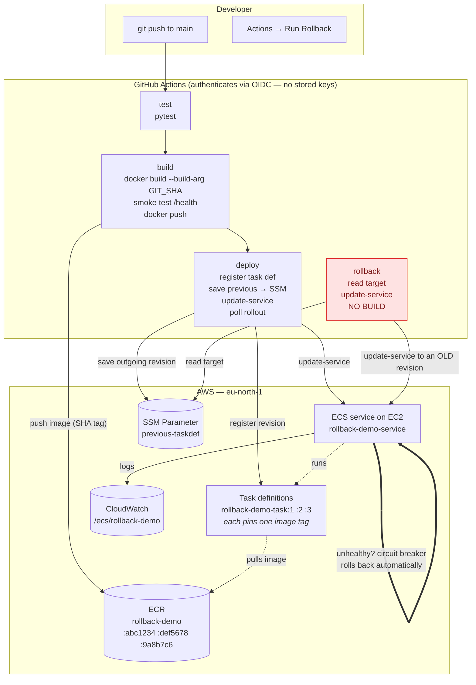

# Automated rollback for Docker images on AWS

**One-command rollback on ECS (EC2 launch type) — redeploy a previously tested image
without rebuilding it.**

When a release goes wrong, the fastest and safest fix is to put back the exact
image that was working ten minutes ago. Not a rebuild of the old commit — the
*same bytes*, already built, already tested, already proven in production. This
repository is a small, working proof of that idea.

---

## What this proves

| Principle | How it is enforced here |
|---|---|
| **Build once** | Every image is tagged with the 7-char git SHA. `:latest` appears nowhere in this repo. |
| **Only tested images ship** | Unit tests *and* a smoke test against the real running container must pass before `docker push`. |
| **Rollback never builds** | The rollback workflow contains no `docker` command at all. It only points ECS at an existing task definition revision. |
| **No AWS keys** | GitHub authenticates to AWS with OIDC — short-lived tokens, nothing stored in the repo. |
| **Safe first run** | If `AWS_ROLE_ARN` is not set yet, the AWS jobs are *skipped*, not failed. |

### Why not just revert the commit and redeploy?

A revert-and-rebuild produces a **new artefact**. Base image layers and
transitive dependencies can resolve differently today than they did last week,
so "the same commit" is not the same image. It also takes minutes and can fail
again. During an incident you want the opposite of novelty:

> **Roll back to a known artefact first. Fix forward afterwards, calmly.**

---

## Architecture



The red box is the point of the whole project: **the rollback path never touches
ECR.**

---

## How a deploy works

1. **`test`** — installs `requirements-dev.txt` and runs `pytest`. If this
   fails, nothing else runs.
2. **`build`** —
   - assumes the AWS role via OIDC and logs in to ECR;
   - the image tag is `${GITHUB_SHA:0:7}`;
   - if that tag is already in ECR, the build is **skipped and reused** (ECR tags
     are immutable, so it is byte-for-byte the tested image);
   - otherwise `docker build --build-arg GIT_SHA=<tag>`;
   - **smoke test**: runs the container and polls `/health` for up to 30s. Unit
     tests prove the code is right; this proves the *image* actually boots;
   - only then `docker push`.
3. **`deploy`** —
   - `jq` replaces the `__IMAGE__` placeholder in `ecs/task-definition.json`;
   - registers it as a new revision (`rollback-demo-task:N`);
   - decides whether the outgoing revision has **proved itself** (rollout
     completed, all tasks running, none failed, alive for `SOAK_MINUTES`) and
     only then promotes it to the SSM pointer — *this is the rollback target*.
     A revision that has not proved itself leaves the pointer untouched;
   - `update-service` to the new revision;
   - polls every 15s for up to 20 minutes, printing the rollout state and the
     latest service event;
   - verifies the new revision is actually live. If ECS rolled back on its own,
     the run fails with an explicit message while production stays healthy;
   - writes a summary table to the run page.

A task definition revision is an immutable snapshot pinning one image tag. The
numbered list of revisions **is** your deploy history, and rollback is choosing
an earlier number.

## How a rollback works

Run the **Rollback** workflow (Actions → Rollback → Run workflow). Both inputs
are optional:

| Input | Meaning |
|---|---|
| `revision` | `rollback-demo-task:5` or just `5`. **Leave empty** to use the revision saved in SSM by the last deploy. |
| `reason` | Free text, recorded in the run summary as an audit trail. |

Then:

1. Read the service's current task definition.
2. **Is a deployment still in flight?** If yes, call
   `stop-service-deployment --stop-type ROLLBACK` — ECS reverses its own
   rollout, which is the fastest option and the one that matters during a
   blue/green bake time.
3. Otherwise resolve the target (input, or SSM), confirm the revision exists,
   and stop early if it is already live (*"already running the rollback target —
   nothing to do"*).
4. `update-service` to that revision, poll, verify.
5. Write a summary: who, why, from → to (with image tags), duration, and
   **"No image was built during this rollback."**

The SSM parameter is deliberately **not** modified, so clicking rollback twice
is harmless.

Same logic from a terminal:

```bash
./scripts/rollback.sh          # use the SSM target
./scripts/rollback.sh 3        # roll back to rollback-demo-task:3
```

---

## Repository variables

**Settings → Secrets and variables → Actions → Variables → New repository
variable.** These are *variables*, not secrets — none of them is sensitive, and
keeping them visible makes the workflows readable. Nothing account-specific is
hardcoded in any workflow file.

| Variable | Value for this project | Used for |
|---|---|---|
| `AWS_REGION` | `eu-north-1` | Region for every AWS call (Europe, Stockholm) |
| `AWS_ROLE_ARN` | `arn:aws:iam::010526241989:role/github-actions-rollback-demo` | The OIDC role GitHub assumes. **Leave empty to skip all AWS jobs.** |
| `ECR_REPOSITORY` | `rollback-demo` | Where images are pushed |
| `ECS_CLUSTER` | `rollback-demo-cluster` | Cluster holding the service |
| `ECS_SERVICE` | `rollback-demo-service` | The service that gets updated |
| `TASK_FAMILY` | `rollback-demo-task` | Used to expand a bare revision number like `5` |
| `CONTAINER_NAME` | `app` | Which container in the task definition gets the new image |
| `SSM_PREVIOUS_PARAM` | `/rollback-demo/prod/previous-taskdef` | Stores the rollback target (**last known good**, not merely the previous revision) |
| `SOAK_MINUTES` | `15` | Optional. How long a revision must run healthily before it is promoted to last known good |
| `LOG_GROUP` | `/ecs/rollback-demo` | Optional. Log group the *Version logs* workflow queries |
| `APP_URL` | the ALB URL | Optional. Lets *What is live?* ask the app directly, and adds a clickable link to deployment records |

---

## Setting it up

AWS side — see **[`infra/README.md`](infra/README.md)** for click-by-click
instructions: ECR repository, CloudWatch log group, `ecsTaskExecutionRole`,
GitHub OIDC provider, the IAM policy and role, and the SSM parameter.

### Create the ECS service

The workflows update an existing service; they never create one. Create it once:

1. Push to `main` with `AWS_ROLE_ARN` set. The deploy job registers
   `rollback-demo-task:1` and warns that the service does not exist — this is
   expected and the run stays green.
2. ECS → Clusters → **Create cluster** → name `rollback-demo-cluster`, and under
   *Infrastructure* choose **Amazon EC2 instances**. Create an Auto Scaling group
   with at least **2** instances (t3.small is plenty) so a rolling deployment
   always has somewhere to place a new task. The wizard attaches
   `ecsInstanceRole` for you.
3. Create an **Application Load Balancer** with a target group of type
   **Instance** on port `8000`, health check path `/health`. Dynamic port mapping
   means you cannot reach a task by a fixed port, so the ALB is how traffic gets
   in — and it gives you one stable URL that survives every deploy and rollback.
4. Inside the cluster → Services → **Create**:
   - Launch type **EC2**
   - Task definition family `rollback-demo-task`, latest revision
   - Service name **`rollback-demo-service`** (must match exactly)
   - Desired tasks: `2` (with 1 task you get downtime during every deploy)
   - **Load balancing** → your ALB and the target group from step 3
   - **Deployment failure detection** → tick *circuit breaker* and *Rollback on
     failures* (needed for Scene 5 of the demo)
5. Open the ALB's DNS name in a browser.

From then on, every push to `main` deploys automatically.

> **Why `hostPort: 0` in the task definition.** On EC2, a fixed host port means
> only one task per instance, and a rolling update then deadlocks: ECS cannot
> start the new task because the port is still held by the old one. `hostPort: 0`
> asks Docker for a free ephemeral port, so old and new tasks coexist on the same
> instance during a deployment. The ALB discovers the actual port automatically.

### Run it locally

```bash
python -m venv .venv
source .venv/bin/activate          # Windows: .venv\Scripts\activate
pip install -r requirements-dev.txt
pytest -v
uvicorn app.main:app --reload      # http://localhost:8000
```

With Docker:

```bash
docker build --build-arg GIT_SHA=local-test -t rollback-demo:local-test .
docker run --rm -p 8000:8000 rollback-demo:local-test
```

---

## Repository layout

```
app/main.py                 FastAPI app; edit APP_COLOR / BANNER_MESSAGE for demos
tests/test_app.py           pytest suite — the first gate in CI
Dockerfile                  python:3.12-slim, non-root, GIT_SHA baked in at build time
ecs/task-definition.json    ECS/EC2 task definition template ("__IMAGE__" placeholder)
infra/                      IAM policies + console set-up instructions
scripts/rollback.sh         Terminal rollback, same logic as the workflow
docs/DEMO.md                Step-by-step demo script for presenting this
app/logging_config.py       Structured JSON logging; every line carries the version
.github/workflows/deploy.yml    test → build → deploy
.github/workflows/rollback.yml  manual rollback, contains no build step
.github/workflows/status.yml    "What is live?" - live version + drift vs GitHub
.github/workflows/logs.yml      "Version logs" - one release's logs in the Actions tab
```

---

## Troubleshooting

**The `build` and `deploy` jobs show as "skipped".**
`AWS_ROLE_ARN` is empty. That is the intended behaviour before AWS is set up —
add the variable when you are ready.

**`Error: Could not assume role with OIDC` / `Not authorized to perform sts:AssumeRoleWithWebIdentity`.**
The role's trust policy does not match the `sub` claim GitHub is sending. AWS
returns this same message whether the identity provider is missing, the role is
missing, or the condition does not match — it will not tell you which.

The catch in this organization: GitHub's **unique token claims** setting is on,
so the `sub` carries immutable numeric IDs and looks like
`repo:EswarBSC@296782642/Automated-rollback-for-Docker-images-on-AWS@1381449371:ref:refs/heads/main`,
**not** the `repo:OWNER/REPO:*` form every online guide shows. The trust policy
must match the long form — see
[`infra/README.md`](infra/README.md) step 6. Also confirm the workflow has
`permissions: id-token: write`.

To see the real claims instead of guessing, run the `Debug OIDC` workflow; it
prints the literal `iss`, `aud` and `sub` without exposing the token.

**`denied: User ... is not authorized to perform: ecr:InitiateLayerUpload`.**
The ECR repository name or region does not match the policy ARN in
`infra/github-actions-policy.json`.

**`Unknown parameter in input: "_comment"` when registering the task definition.**
JSON has no comments and `register-task-definition` rejects unrecognised keys.
Keep `ecs/task-definition.json` free of extra fields.

**Tasks keep stopping with `ResourceInitializationError ... logs`.**
The CloudWatch log group `/ecs/rollback-demo` does not exist, or
`ecsTaskExecutionRole` cannot write to it. Create the group manually.

**Tasks stop with `CannotPullContainerError`.**
Your EC2 container instances cannot reach ECR. They need either a public subnet
with a public IP, a NAT gateway, or VPC endpoints for ECR and S3. Also confirm
the instance profile includes `AmazonEC2ContainerServiceforEC2Role`.

**The deploy fails with "ECS automatically rolled back to …".**
Working as designed: the new version failed its health checks and ECS restored
the previous one. Read the container logs in `/ecs/rollback-demo`, fix, push
again. Production never served the broken version.

**Rollback says "No revision was given and the SSM parameter … is empty".**
There has been no successful deploy yet, so no rollback target was recorded.
Pass a revision explicitly: run the workflow with `revision` = `1`.

**The rollback workflow is queued behind a deploy.**
It should not be — they use different concurrency groups (`deploy-prod` and
`rollback-prod`). If it is queued, check that both workflow files still have
their own `concurrency.group`.

---

## Things this demo deliberately does not do

- No Terraform or CDK — the AWS objects are created by hand once, so a beginner
  can see exactly what exists and why.
- No database, so no schema-migration story. Rollback covers the application
  tier only; migrations must be backwards-compatible for *any* rollback
  strategy to work.
- No automatic alarm-to-rollback wiring. A human clicks the button, and the
  reason is recorded. [`docs/DEMO.md`](docs/DEMO.md) explains how to automate it
  if you want to.
